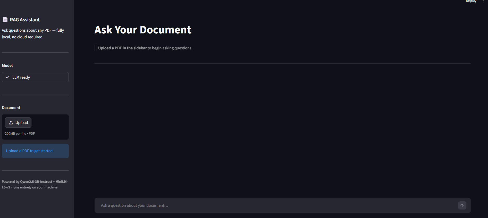
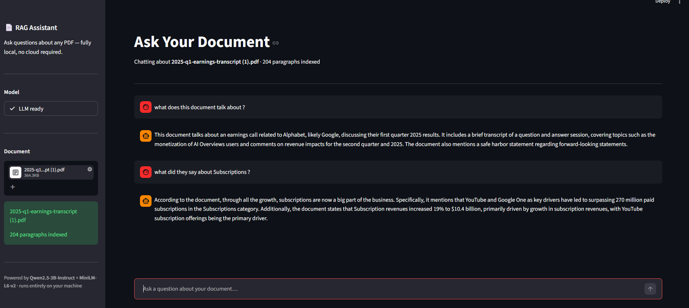

# Local RAG Assistant

A fully local Retrieval-Augmented Generation (RAG) system built with Python, Streamlit, TinyLlama, and MiniLM.

---

## Project Overview

This project allows users to upload PDF documents and ask questions in natural language.

The application extracts text from PDFs, converts document content into vector embeddings using MiniLM, retrieves relevant information through semantic search, and generates answers using TinyLlama running locally.

The entire pipeline runs locally without relying on external APIs.

---

## Features

- PDF Upload
- Text Extraction
- Text Chunking
- Local Embeddings
- Semantic Search
- Retrieval-Augmented Generation
- Streamlit Chat Interface
- Local LLM Inference

---

## Architecture

### Flow Diagram

---

## Screenshots

### Home Screen

### Question Answering

